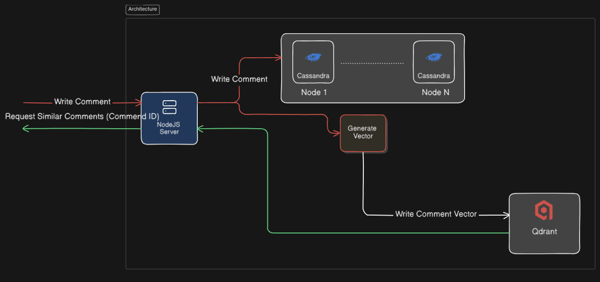

# 🧠 Semantic Comment Search Demo 
Nearment (Near + Comment) is a full-stack demo using **React**, **Express**, **Qdrant**, and **Cassandra** for semantic search over user comments. Designed for product comment analysis and searching.

## ✨ Features
- 💬 Submit comments with auto-detected **sentiment purpose**
- 🔍 Find similar comments using **vector similarity**
- 🔧 Filter by product or sentiment category (good/bad)
- ⚡ Fast Qdrant-based semantic retrieval

## 🧠 Visual Diagram
<p align="center">
  
</p>

## 🧩 Stack Overview
| Layer         | Tech                            | Description                                 |
|---------------|----------------------------------|---------------------------------------------|
| Backend       | Express.js                      | API to process, vectorize, store, and query |
| General DB    | Cassandra                       | Stores comments                             |
| Vector DB     | Qdrant                          | Stores purpose embeddings                   |
| Sentiment     | Gemini API                      | Generates score, comparative and purpose    |
| Embedding     | npm @huggingface/transformers   | Generates 384d vectors from text purpose    |

---

## 🛠️ Installation

### 1. Clone the repo

```bash
git clone https://github.com/prodemmi/semantic-comment-search.git
```

### 2. Set up environment variables
Create .env file in root:

```env
KEYSPACE=comment
CASSANDRA_TABLE=vectors
CASSANDRA_REPLICATION_CLASS=SimpleStrategy # Use NetworkTopologyStrategy in production
CASSANDRA_REPLICATION_FACTOR=1 # Use 2 or 3 in production

GEMINI_API_KEY=
GEMINI_BASE_URL= # (Optional) Use for reverse proxy with Worker-based redirect 
```

### 3. Install dependencies
```bash
npm install
cd demo-react
npm install
```

### 4. Run locally
```bash
# in root
npm run start

# in demo-react/
cd demo-react && npm run dev
```

## 📡 API Documentation
### 📌 POST /comments
Submit a new comment, analyze its sentiment & purpose, generate vector, and store it in both Cassandra and Qdrant.

🔸 Request Body
```json
{
  "text": "The product was fake and the box was damaged.",
  "product_id": "5"
}
```
### 📌 GET /same.subject
Find comments related to a conceptual subject (e.g. "bad", "good") based on front-end filters for a specific product.

🔸 Query Params
| Name         | Type   | Required | Description                                      |
| ------------ | ------ | -------- | ------------------------------------------------ |
| `subject`    | string | ✅        | Semantic subject key (e.g., `"bad"` or `"good"`) |
| `product_id` | string | ✅        | Target product ID                                |

🔸 Response
```json
{
  "data": [
    {
      "id": 120, // comment id
      "text": "The product was clearly fake."
    },
    ...
  ]
}
```

### 📌 GET /same.comments/:id
Find similar comments based on the semantic vector of a specific comment.

🔸 URL Params
| Name | Type   | Required | Description                 |
| ---- | ------ | -------- | --------------------------- |
| `id` | string | ✅        | ID of the reference comment |

🔸 Example

```
GET /same.comments/:comment-id
```

🔸 Response
```json
{
  "data": [
    {
      "id": 80,
      "text": "Really poor packaging and fake product."
    },
    ...
  ]
}
```

### 📌 Notes
- Vectors are generated using **@huggingface/transformers** based on the purpose of each comment.

- Qdrant is used for semantic similarity search.

- Cassandra stores raw comment data and metadata.

## 🧠 Purpose Detection Format
Each comment is analyzed to extract:
```json
// Example comment text: "This product is clearly fake. The box was crushed and the quality is awful. I really regret buying it — terrible experience overall."
{
  "score": -7, // Between -10 and +10, 0 for Neutral
  "comparative": -0.43, // Score / total word count
  "purpose": "The product was fake, the packaging was damaged, I had a bad experience, I regretted the purchase, the quality was poor."
}
```
Only the purpose is vectorized and stored in Qdrant.

## 📖 License
MIT — use it for research, demos, or product feedback engines.
